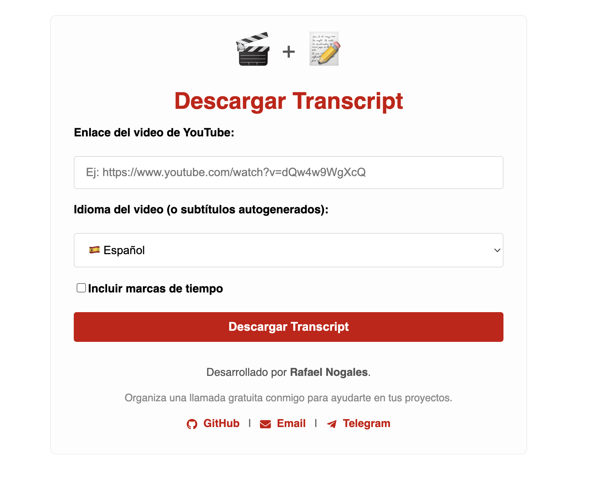

# YouTube Transcript Downloader

Esta aplicación web permite obtener y descargar el transcript (subtítulos) de un video de YouTube en formato TXT. La solución integra:

- **Backend:** API en Flask (Python) que utiliza la librería [youtube-transcript-api](https://github.com/jdepoix/youtube-transcript-api) para extraer los subtítulos.
- **Frontend:** Aplicación en React que permite al usuario ingresar el ID del video (y opcionalmente el idioma) para descargar el transcript.
- **Docker:** Un contenedor multi-stage que compila el frontend y empaqueta junto con el backend en una sola imagen.

## Estructura del Proyecto

La estructura básica del proyecto es la siguiente:

mi-app/  
├── backend/  
│ ├── app.py # Código de la API en Flask  
│ └── requirements.txt # Dependencias de Python  
├── frontend/  
│ ├── package.json # Configuración del proyecto React  
│ ├── public/  
│ │  
└── index.html # Template HTML para React  
│ └── src/  
│ └── App.js # Código principal de la aplicación React   
└── Dockerfile # Dockerfile con multi-stage build  


## Cómo Funciona

1. **Frontend (React):**  
   - El usuario ingresa el ID del video de YouTube y opcionalmente el código del idioma (por ejemplo, "es" para español).
   - Al pulsar el botón "Descargar Transcript", se realiza una petición a la API del backend.

2. **Backend (Flask):**  
   - La API recibe el `videoId` (y opcionalmente `language`) y utiliza la librería `youtube-transcript-api` para obtener los subtítulos.
   - Si se obtienen exitosamente, genera un archivo TXT formateado (con marcas de tiempo) y lo envía como descarga.

3. **Integración:**  
   - La aplicación React se compila y se copia al directorio de la build del backend para ser servida de forma estática junto con la API Flask.

## Requisitos Previos

- [Docker](https://www.docker.com/get-started) instalado en el sistema.

*Opcional:* Si deseas probar el proyecto sin Docker, necesitarás:
- Python 3.9+  
- Node.js (para el frontend)  

## Instalación y Ejecución con Docker

1. **Construir la imagen Docker**

   Desde la raíz del proyecto (donde se encuentra el archivo `Dockerfile`), ejecuta:

```
bash
docker build -t mi-app .
```

Ejecutar el contenedor  
Inicia el contenedor mapeando el puerto 5000:  

```
docker run -p 5000:5000 mi-app
```
La aplicación estará disponible en http://localhost:5000.  
Uso  

Accede a la URL http://localhost:5000 en tu navegador.  
Ingresa el ID del video de YouTube (por ejemplo, dQw4w9WgXcQ).  
Opcionalmente, ingresa el código del idioma (por ejemplo, es).  
Haz clic en "Descargar Transcript".  
Se iniciará la descarga del archivo TXT con el transcript del video, si es que el video cuenta con subtítulos disponibles.  

## Desarrollo Local (Opcional)

Si deseas ejecutar el proyecto sin Docker, sigue estos pasos:

### Backend
Navega a la carpeta backend y crea un entorno virtual:
```
cd backend
python -m venv venv
source venv/bin/activate     # En Windows: venv\Scripts\activate
pip install -r requirements.txt
Ejecuta la aplicación Flask:
flask run --host=0.0.0.0 --port=5000
```

### Frontend
Navega a la carpeta frontend y asegúrate de tener instaladas las dependencias de Node.js:
```
cd frontend
npm install
````

Ejecuta la aplicación React en modo desarrollo:
```
npm start
```
Nota: En desarrollo, es posible que debas configurar un proxy en el archivo package.json del frontend para redirigir las peticiones a la API Flask (por ejemplo, añadiendo "proxy": "http://localhost:5000",).

## Consideraciones Finales

CORS: La configuración actual utiliza flask-cors para permitir peticiones desde el frontend.  
Si despliegas en producción, revisa las configuraciones de seguridad.  
Subtítulos Disponibles:  
La funcionalidad depende de que el video de YouTube tenga subtítulos (ya sean generados automáticamente o subidos manualmente). Si no los tiene, se generará un error.  

¡Disfruta de la aplicación y contribuye con mejoras si lo deseas!


